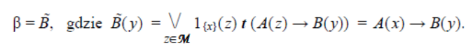
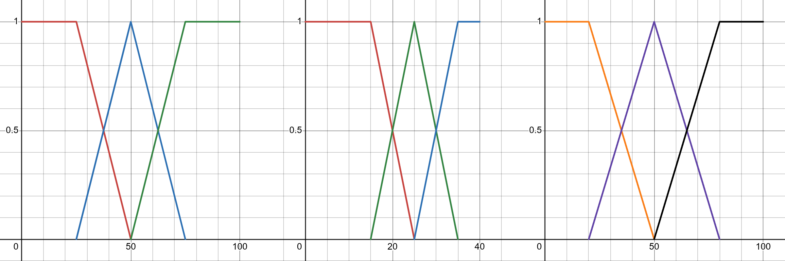

# Modelowanie i przetwarzanie informacji nieprecyzyjnej

---

# Zajęcia VI

---

## Problem

Jak zaimplementować sterownik rozmyty?

---

## Etapy sterowania

1. Fuzyfikacja
2. Wnioskowanie
3. Agregacja
4. Defuzyfikacja

---

## Przykład

Sterujemy wentylatorem w łazience, cel: pozbycie się wilgoci z pomieszczenia.

Zmienne lingistyczne: $temperatura$, $wilgotnoc$, $predkosc\ wentylatora$

---

## Zmienne

<small>

|               |                       |                         |                               |
| ------------- | --------------------- | ----------------------- | ----------------------------- |
| $wilgotnosc$  | niska $Tr(0,0,25,50)$ | srednia $T(25,50,75)$   | wysoka $Tr(59, 75, 100, 100)$ |
| $temperatura$ | zimno $Tr(0,0,15,25)$ | letnio $T(15,25,35)$    | cieplo $Tr(25, 35, 50, 50)$   |
| $predkosc$    | wolno $Tr(0,0,20,50)$ | spokojnie $T(20,50,80)$ | szybko $Tr(50,80,100,100)$    |

</small>

---

## Reguły

<small>

- IF wilgotnosc IS niska AND temperatura IS zimno THEN predkosc IS wolno
- IF wilgotnosc IS wysoka THEN predkosc IS szybko
- IF wilgotnosc IS srednia AND temperatura IS letnio THEN predkosc IS spokojnie

</small>

---

## Defuzyfikacja

Czujnik temperatury odczytał 31℃, a czujnik wilgotności 40%.

---

## Krok reguł

Najczęściej stosuje się:

- operator implikacji Mamdaniego: $a\rightarrow b = a\wedge b$
- operator implikacji Larsena: $a\rightarrow b = ab$

---

---

## Defuzyfikacja

- maksimum funkcji przynależności
- metoda środka ciężkości

$x = \frac{\sum P_i * x_i}{\sum P_i}$

---

## Zadanie lab I

Potwórz przykład, ale odczyty są następujące:

- wilgotność: 60%
- temperatura: 25℃

---

## Zadanie I

Potwórz zadanie lab I, ale użyj implikację Larsena

---

## Zadanie II

Potwórz przykład, ale odczyty są następujące:

- wilgotność: 25%
- temperatura: 34℃

Oraz wymień drugą regułę na:

- IF wilgotnosc IS wysoka OR temperatura IS cieplo THEN predkosc IS szybko
