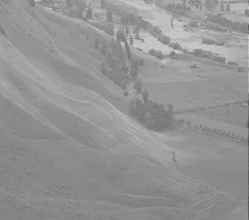
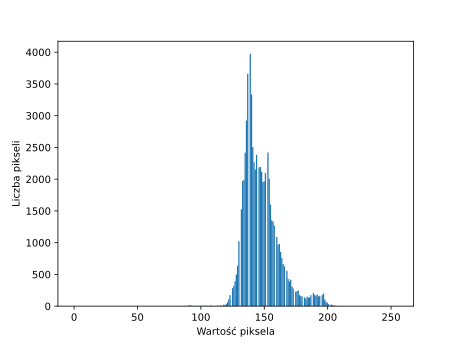
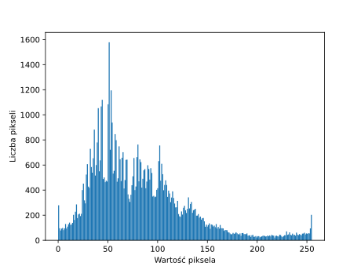

# Modelowanie i przetwarzanie informacji nieprecyzyjnej

---

# Zajęcia XII

---

## Praktyczne użycie rozmytości

---

- grupowanie
- klasteryzacja
- klasyfikacja
- przetwarzanie obrazów

---

## Wzmacnianie obrazu

---

## Histogram

---

## Histogram (ale lepszy)

---

## Kontrast

---

## Sterownik rozmyty

1. `IF pixel IS jasny THEN out = jaśniejszy`
2. `IF pixel IS szary THEN out = 'szarszy'`
3. `IF pixel IS ciemny THEN out = ciemniejszy`

---

## Zadanie I

<small>

Napisz program w `python`, który:

1. wczyta dowolny obraz z ścieżki podanej w wywołaniu
2. przekonwertuje obraz na czarno-białą macierz z wartościami $[0-255]$
3. w 4 krokach (fuzyfikacja, wnioskowanie, agregacja, defuzyfikacja) wzmocni kontrast na danym obrazie i go wyświetli

Nie korzystaj z żadnych bibliotek w programie poza `matplotlib` (wyświetlenie obrazu), `pillow` (wczytanie obrazu).

</small>
